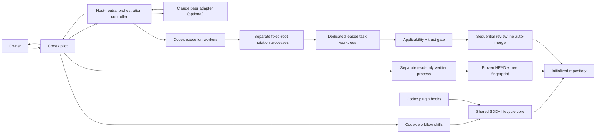

# Codex Host Build Blueprint

Status: cross-model architecture converged; implementation awaits Owner
approval of this blueprint and MVP boundary

Change packet: `sdd-plus/changes/codex-host-mvp/`

Evidence date: 2026-07-25

This blueprint supersedes the unverified architectural assumptions in
`docs/CODEX_PORT_PROPOSAL.md`. The proposal remains useful as the original
conversation; this document is the evidence-backed implementation boundary.

## 1. Product Goal

Make Codex the primary Drydock host so the Owner can govern work across
repositories from one orchestrator, while retaining Claude/Fable as an
independent planning and review peer when it is available.

The port SHALL preserve Drydock's source-of-truth lifecycle, proportional
ceremony, independent verification, and deterministic local safety controls.
It SHALL also state the boundary of those controls precisely.

## 2. Users

- Primary: the Owner operating Drydock across several repositories through
  Codex desktop, voice, or CLI.
- Secondary: developers installing Drydock as a Codex plugin and initializing
  it in individual repositories.
- Existing Claude Code users remain supported throughout the MVP.

## 3. Core Workflows

1. Before implementation, prove one authenticated, bounded, structured Claude
   CLI round trip and obtain cross-model convergence on this architecture.
2. Install Drydock once as a Codex plugin.
3. Start a fresh Codex task, review hook definitions, and trust the hooks.
4. Initialize a repository so its context, SDD+ files, and project-scoped
   execution agents exist.
5. Ask Codex to plan a meaningful change.
6. When Claude is authenticated and available, negotiate the plan through a
   bounded, structured peer exchange; otherwise report the missing peer
   explicitly and retain Codex-hosted governance.
7. Delegate each mutating implementation task through a separate ephemeral
   Codex process whose fixed `workspace-write` sandbox is rooted at its own Git
   worktree and task branch, never the Owner working tree.
8. Cross-review work sequentially, never while the reviewed tree is changing;
   never auto-merge a delegated result.
9. Run the independent verifier in a separate read-only Codex process bound to
   a repository fingerprint.
10. Verify, sync specs, archive, and only then publish.

## 4. MVP Scope

### Shared behavior

- Reuse `scripts/sdd.py`, standards, templates, change packets, capability
  specs, and independently tested pure policy primitives.
- Preserve the existing Claude plugin as the working reference and fallback.
- Add new host adapters without moving or rewriting the current Claude
  packaging in the first implementation slice.

### Slice 1 compatibility boundary

The first implementation slice is additive and SHALL leave these proven
surfaces untouched: `scripts/sdd.py` and its scaffold twin,
`scripts/conductor/`, `hooks/`, `agents/`, `commands/`, `skills/`,
`tests/`, living capability specs, and `.claude-plugin/`. New Codex adapter
code and its first regression tests live in new Codex-owned paths. Living specs
change only later through the normal sync/archive gate. If a new pure primitive
eventually must be exposed from an existing hook module, it is added without
changing any existing signature or behavior and only after this slice passes
the 501-test and 11-pair sync tripwires.

### Codex host

- A self-contained Codex plugin root at `adapters/codex/drydock/`, including a
  valid `.codex-plugin/plugin.json`, plugin-root skills, and plugin-root hooks.
  Keeping this root separate prevents Codex default discovery from loading the
  existing Claude hook definitions.
- Codex workflow skills for lifecycle operations; they are skills, not claimed
  slash-command equivalents.
- Codex-native lifecycle and tool hooks with Windows command overrides.
- An evidence-based readiness report for the active task and repository.
- Project-scoped advisory-agent scaffolding through `.codex/agents/*.toml`.
- A separate-process independent verifier with fixed read-only flags.
- A host-neutral orchestration controller plus a Claude peer adapter.

### Safety and honesty

- Exact disclosure of hook trust, management, liveness, freshness, and tool
  coverage.
- CI and release checks that deterministically rebuild the normalized runtime
  bundle and force the trusted hook definition to change whenever executable
  hook-handler content changes.
- One-writer-per-worktree containment and truthful applicability/test gates for
  every mutating delegation.
- Structured results for every peer and verifier failure.
- No silent downgrade from two-brain agreement to one-brain agreement.

## 5. Non-Goals

- Administrator-managed hook deployment through MDM or `requirements.toml`.
- A claim that ordinary plugin hooks are non-disableable or cover every tool.
- Replacing the existing Claude plugin during the MVP.
- Packaging custom agents through an undocumented plugin mechanism.
- Building an SDD+ MCP server.
- Automatic merge, push, deployment, or external publication.
- General governance of hosted tools that do not enter Codex's local hook path.
- Hiding Claude unavailability or spending Claude quota automatically.

## 6. System Components

| Component | Responsibility |
| --- | --- |
| Shared lifecycle core | `scripts/sdd.py`, specs, standards, templates, packet gates |
| Existing Claude adapter | Current commands, hooks, verifier, and Claude→Codex conductor |
| Codex plugin adapter | Self-contained `adapters/codex/drydock/` package: manifest, Codex skills, hook wiring, readiness, Windows integration |
| Policy primitives | Only proven host-neutral functions such as secret-path classification, command write-target extraction, and destructive-git token analysis |
| Stateful hook adapters | Host-native packet, session-orientation, and completion state machines sharing lifecycle contracts, not hook entry points |
| Orchestration controller | Bounded negotiation, delegation map, failure and disagreement handling |
| Claude peer adapter | Auth check, bounded headless call, schema validation, secret guard, cost/timeout limits |
| Codex execution adapter | Right-sized nested agents for advisory work and separate fixed-root processes for mutation |
| Mutation runner | One separate process and reclaimable exclusive lease per dedicated worktree/branch, runner-owned Git mutations, Owner-state fingerprinting, applicability-first gate, structured non-merge result, bounded cleanup |
| Verifier runner | Separate ephemeral `codex exec` process with immutable read-only arguments |
| Project scaffold | `AGENTS.md`, SDD+ state, lifecycle CLI, and `.codex/agents/` definitions |
| Readiness reporter | Active-task hook liveness plus repo, peer, runtime, and coverage status |

The MVP is additive. Existing Claude paths stay in place while Codex-specific
files live behind the Codex manifest and adapter boundary.

## 7. Data Model Sketch

Drydock adds no database. The relevant local records are:

- `HostReadiness`: host version, plugin version, task/session identifier,
  initialization state, Python/core discovery, and freshness.
- `EnforcementProfile`: hook source, enabled/trusted/managed state, definition
  hash, handler revision, active-task liveness, and covered/uncovered paths.
- `PeerStatus`: adapter, installed/authenticated/available state, model,
  bounded-cost settings, and last structured failure category.
- `PlanCritique`: round, convergence, blockers, gaps, risks, and task
  decomposition.
- `ExecutionEnvelope`: captured base, worktree, task branch, writer identity,
  diff, files, timeout, tests, applicability/trust verdict, and
  `merged: false`.
- `VerificationEnvelope`: repository HEAD, working-tree fingerprint, verifier
  model/sandbox, commands and results, verdict, and end fingerprint.

Records SHALL contain no credentials, secret values, or full private prompts in
long-lived logs.

## 8. Data Flow

Claude output is untrusted peer input. It can change a plan only after Codex
audits it. Neither retrieved content nor a peer response can authorize a side
effect.

## 9. API and Interface Boundaries

### Host adapter

- Discovers the active host and executable.
- Exposes lifecycle invocation, active-task readiness, and supported local
  agent capabilities.
- Never claims a hook is live from file presence alone.

### Peer adapter

- `status()` distinguishes absent, unauthenticated, unavailable, rate-limited,
  and ready.
- `critique_plan()` and `review_change()` return schema-validated envelopes.
- All outcomes are structured; process exit failure or `is_error: true` is a
  failure even if another field says `success`.
- Prompts are sent on stdin or another non-argv channel when practical.

### Verifier runner

- Builds fixed arguments that callers cannot override: explicit model,
  `--ephemeral`, `-s read-only`, bounded timeout, and no write-capable fallback.
- Treats the working root as task context, not as a read-confinement claim.
  One earlier tested build could read outside that root; the later live final
  verifier denied an external proof-store read. Host-read behavior is therefore
  point-in-time platform evidence, never a stable confinement or reachability
  claim.
- Supplies an exact command-scoped Git map plus
  `shell_environment_policy.inherit="core"`: command-scope `safe.directory`
  for only the canonical delegated root, null global/system configuration, no
  system attributes, optional locks, or prompts, and one canonical ceiling.
  The map pins named values; Codex's `core` inheritance profile is the requested
  mechanism excluding unlisted parent variables. Repository tests prove argv
  shape, while replace-versus-merge semantics, `core` membership, and effective
  child values require point-in-time live evidence. Internal Git helpers
  independently pass command-scoped `safe.directory` because they strip
  inherited `GIT_*`. Nothing writes Owner or global Git configuration.
  On native Windows with Codex CLI 0.146.0-alpha.3.1, a live probe excluded a
  simulated lower-priority Owner sentinel plus poisoned parent `GIT_*` and
  unrelated values. Codex retained the requested values but appended a second
  equivalent native-path `safe.directory`, producing effective
  `GIT_CONFIG_COUNT=2`; result metadata consequently calls the map requested,
  not achieved. The probe is point-in-time and did not use a real Owner config
  file as its lower-precedence layer.
- Binds the verdict to HEAD plus a working-tree fingerprint in three places:
  the prompt, exact schema constants echoed by the verifier, and an
  independently recomputed post-run fingerprint. Nested verdict fields and
  the state binding are validated, not just top-level types. The echo is
  freshness/anti-replay evidence, not proof the model inspected the state.
- Terminates and proves its supported process-tree boundary quiescent before
  recomputing the fingerprint or reading the verdict file.
- Invalidates the verdict if the tree changes while verification runs.
- Returns BLOCKED if isolation or fingerprinting cannot be established.
- Establishes process, context, and permission isolation only. A same-family
  Codex process is not claimed as an independent epistemic vantage.
- Recomputes v2 identity and refuses provider spawn or PASS unless the bounded
  full-suite record is structurally accepted for the exact fingerprint, then
  supplies that same record to the verifier instead of duplicating pytest
  inside a boundary that correctly has no writable temporary directory. The
  record remains user-writable, unauthenticated, and insufficient for PASS; its
  structural admission does not attest execution provenance.

### Mutation runner

- Captures the base commit, creates one dedicated worktree and reserved task
  branch per writer, then launches a separate ephemeral `codex exec` process
  with non-overridable `-s workspace-write` and `-C <canonical-worktree>`
  arguments. It never delegates mutation to a nested agent.
- Creates the reserved worktree container inside the repository workspace and
  refuses mutation unless `.drydock-worktrees/` is ignored. On the tested
  alpha CLI, `--ignore-user-config` also discards repository trust and silently
  downgrades the child to read-only. The runner therefore loads the
  Owner-trusted config as part of the TCB, ignores exec rules, and fixes empty
  MCP config, disabled web/network/root expansion, a reduced shell
  environment, and disabled hook/plugin/app/browser/computer-use feature
  surfaces on the command line. Provider/auth/base-URL selection, model
  instruction files, and any unpinned notification/telemetry settings remain
  explicit Owner-config trust dependencies rather than hidden clean-config
  claims.
- Holds an atomic exclusive lease for each canonical worktree while its process
  is alive. Concurrent writers receive separate worktrees and leases. A stale
  lease is reclaimable only beyond the worker timeout plus cleanup grace and
  after the recorded exact process identity is proven gone; uncertain liveness
  refuses reclamation.
- Owns Git metadata mutations itself. Before any post-worker Git command, it
  validates the worktree `.git` link against the administrative directory
  captured from trusted main-repository metadata and passes explicit
  `--git-dir`/`--work-tree` arguments. After worktree creation and before the
  worker starts, it directly hashes a bounded set of Git control bytes:
  repository/worktree configuration, active HEAD/ref state, indices, hooks,
  attributes/excludes, alternates, replacement refs, and worktree
  administrative pointers. After process-tree shutdown it rechecks that
  fingerprint before any post-worker Git command. Drift refuses all Git
  inspection. Runner Git also pins executable local-config surfaces such as
  `core.fsmonitor`, `core.hooksPath`, attributes, and external diff.
  The Git executable is resolved once from absolute PATH entries before
  delegation and invoked by absolute path, so a worker-local `git.exe` cannot
  enter executable search. Local Git config includes and external
  clean/smudge/process filters are unsupported and refuse before worktree
  creation; this prevents extraction or checkout from executing commands whose
  bytes are outside the fingerprinted control surface.
  Review diff extraction uses a temporary index and temporary object store, so
  it does not write the Owner index or shared object database. This does not
  authorize automatic merge or integration.
- Starts the Windows worker suspended, assigns it to a kill-on-close Job
  Object, then resumes it. POSIX uses a separate process group. The runner
  terminates the full boundary before fingerprinting or diff extraction, so a
  descendant cannot mutate after the reviewed snapshot on the proven Windows
  host. POSIX process-group cleanup is reported as best-effort and cannot clear
  an adversarial-containment gate because `setsid()` can escape it.
- Scans without following links and rejects symlinks, Windows junctions, and
  other reparse points plus multi-linked regular files before extraction and
  cleanup. Worker changes to `.gitattributes` invalidate the review diff;
  external diff/text conversion is disabled.
- Fingerprints Owner HEAD and working-tree state before execution and again
  after worker quiescence but before diff extraction. Drift stops extraction,
  returns no delegated change evidence, and rejects the result. The Git-control
  and Owner fingerprints are rechecked after extraction as defense in depth.
- Reuses the six proven `codex-conductor` containment guarantees as a contract:
  worktree isolation, no auto-merge, applicability before pass/fail, timeout
  never green, untrusted evidence never green, and narrowly bounded cleanup.
- Returns structured evidence including ignored worker artifacts and
  `merged: false`. The mutation-only runner never returns green: applicable
  work becomes `awaiting_verification`, inert text becomes `review_required`,
  and ignored artifacts receive their own blocking stage. Only the separate
  verifier plus deliberate integration can advance the work.
- Treats a successful process with no changed files as `no_changes`/BLOCKED;
  absence of a mutation is not task-completion evidence.
- Defaults extensionless and unclassified paths to verification-required.
  Only a small inert `.md`/`.rst`/`.txt` allowlist may be test-N/A, and that
  N/A result still requires deliberate review and is not green.

### Hook adapter

- Consumes Codex's canonical `Bash`, `apply_patch`, MCP, and local-function
  payloads rather than assuming Claude names.
- Emits Codex-supported structured outputs.
- Uses `commandWindows` and plugin environment variables.
- Registers narrow explicit matchers for known side-effect contracts. It does
  not install a broad fail-closed matcher over unrelated/read-only tools.
- If a matched hook receives a tool/payload contract other than the one its
  matcher promised, it denies rather than guessing. A tool outside all guarded
  matchers is not intercepted and is reported as uncovered, never as
  policy-allowed.
- Reuses only proven pure primitives. In particular,
  `protect_secrets.check()` is a Claude-name dispatcher and is not a shared
  policy API; packet, orientation, and completion behavior stays stateful and
  host-native.

## 10. Threat Model, Auth, and Permissions

The ordinary-plugin profile treats the tool-producing model, retrieved
content, repository content, and peer output as potentially adversarial. For a
covered current call, the model may also have influenced mutable plugin runtime
bytes. The guard must therefore withstand malformed payloads, unknown tool
names, prompt-injected evasion attempts, plugin-runtime byte tampering, and
file-swap attempts between integrity checking and policy execution.

The trusted computing base is the Codex host, operating system, selected Python
interpreter, trusted hook definition and trust store, plus explicit Owner
approval state. The hook command SHALL start Python in isolated/no-site mode
(`-I -S` or a proven equivalent) and pin imports to trusted standard-library
roots before verified bundle code runs. The ordinary plugin does not
cryptographically authenticate the host or interpreter binary; readiness must
name that assumption.

The profile does **not** claim protection from the Owner or an administrator
who disables hooks, approves a changed definition, replaces the Codex host,
interpreter, or trust store, or modifies managed policy. It also does not claim
containment after an agent has already obtained an uncovered arbitrary-write
path into that trusted computing base, and it does not cover
hosted/specialized tool paths that the host does not send through local hooks.
Those limits are surfaced by readiness rather than hidden.

- Codex uses the Owner's existing Codex authentication and permission mode.
- Normal plugin hooks are non-managed, definition-trusted, and user-disableable.
- Claude authentication remains owned by Claude Code. Drydock SHALL never read,
  copy, store, or log Claude credentials.
- The Claude peer is side-effect-free by mechanism: its only built-in tool is
  the schema-return `StructuredOutput` tool, safe mode and strict MCP
  configuration exclude local customizations and configured MCP servers,
  Chrome is disabled, there is no session persistence, and timeout and
  reported usage are bounded and validated.
- Native nested agents inherit live parent permission overrides. Therefore a
  nested custom agent is neither the independent-verification boundary nor the
  mutating-execution containment boundary.
- Mutating workers run as separate fixed-root processes. Publication,
  integration, and destructive actions remain separately approval-gated.

## 11. External Services and Integrations

| Integration | Dependency | Failure behavior |
| --- | --- | --- |
| Codex CLI/app server | Installed Codex desktop/CLI and Owner auth | Readiness reports unavailable; lifecycle core remains local |
| Claude Code CLI | Optional installed CLI and explicit Owner login | Peer unavailable; no fake negotiation or quota spend |
| Git | Local repository | Mutation/verification that needs Git is BLOCKED |
| Python 3.9+ | Bare local Python | Scripted controls unavailable and reported as such |

There is no telemetry, hosted database, or Drydock-owned credential store.

## 12. Risks and Tradeoffs

| Risk | Decision |
| --- | --- |
| Plugin hooks can be disabled | Describe them as conditional deterministic local guardrails, not a complete boundary |
| Hook trust hashes only the definition | Put a minimal verifier and exact bundle digest literally in the trusted definition; read runtime bytes once, verify them, pin mutable plugin paths out of imports, then compile/execute those same captured bytes in memory |
| Verify-then-import creates a file-swap race | Never import a verified plugin path; a release-built self-contained runtime bundle is executed from the verified byte buffer, and unexpected importable runtime files deny |
| Definition trust does not hash the interpreter | Treat the Codex host, OS, selected interpreter, and trust store as an explicit trusted computing base; launch in isolated/no-site mode and report this assumption instead of claiming end-to-end binary attestation |
| Hosted or specialized tools bypass local hooks | Publish exact coverage and retain repo/git/CI backstops |
| Existing tasks do not hot-load a new plugin | Require a fresh task and active-task liveness evidence |
| Parent permissions override custom-agent sandbox | Use separate fixed-flag processes for both read-only verification and workspace-write mutation; native nested agents are advisory, not containment boundaries |
| Worker rewrites its linked `.git` file and redirects trusted runner Git | Capture the administrative directory from main-repository metadata, verify the control link after process-tree shutdown, use explicit Git roots, and build diffs in temporary index/object storage |
| Worker poisons repository-local Git config, hooks, refs, or control files | Directly fingerprint the bounded executable/control surface before the worker, recheck it before the first post-worker Git command and after extraction, pin executable Git config keys, and refuse all Git inspection on drift |
| Worker plants a Git executable or activates an external clean filter | Resolve Git only from absolute PATH directories before delegation and invoke the pinned absolute binary; refuse local config includes and clean/smudge/process filter commands before worktree creation |
| Worker descendant survives the direct process | Start inside a kill-on-close Windows Job Object or separate POSIX process group and terminate the complete boundary before fingerprint/diff extraction; this proves descendant lifetime shutdown on Windows, not filesystem confinement by itself |
| Worker plants a junction/reparse point, floods the tree scan, or suppresses diff content | Refuse any link/reparse path before extraction and cleanup; stream and cap the no-follow scan by entry count so a single directory is not materialized before the limit, then fail closed before extraction when exceeded; reject worker-modified `.gitattributes`; disable external diff and text conversion |
| POSIX descendant calls `setsid()` | Report process-group cleanup as best-effort and refuse a green adversarial-containment verdict until a cgroup/PID-namespace or equivalent boundary is proven |
| Same-vendor verifier shares model blind spots | Describe separate-process verification as process/context/permission isolation; require Claude or another genuinely different peer before claiming cross-model review |
| Mutating agents can collide with or alter Owner work | One separate fixed-root process plus atomic reclaimable lease per dedicated worktree/task branch, runner-owned Git metadata changes, Owner fingerprint checks, no auto-merge, sequential integration, and blast-radius-bounded cleanup including orphaned leases |
| Broad fail-closed matcher bricks renamed/read-only tools | Match only explicit supported side-effect contracts; deny mismatches inside a matched hook and report unmatched tools as uncovered |
| Generated policy bundle drifts from sources | Use a deterministic plain UTF-8/LF single-file format and run exact rebuild comparison in CI alongside `check_sync.py`, then repeat at release |
| A separate Codex plugin root cannot see the repository-level project scaffold after packaging | Generate one deterministic digest-bearing scaffold bundle from `assets/project-scaffold/`; exact rebuild comparison runs in CI and initialization verifies every entry before a create-only write |
| Claude is installed but unauthenticated | Block implementation of the two-brain path until one authenticated Phase 0 probe succeeds; Codex-only governance may still operate but cannot claim peer agreement |
| Parseable output bypasses nested schema or numeric bounds | Deeply validate verifier fields and exact state echo; reject non-standard/non-finite JSON and non-finite peer budgets/costs |
| Unknown change type is classified test-N/A | Default extensionless/unclassified files to verification-required; keep only inert text/docs in the N/A allowlist, and never make N/A green |
| Codex APIs are currently alpha-versioned | Pin tested host versions in evidence and maintain live opt-in contract smoke tests |
| Windows launcher/path behavior differs | Reuse robust core discovery; prove `commandWindows`, paths with spaces, and the exact inline verifier below the supported command-line limit |
| Two adapters can drift | Contract tests run shared pure-policy vectors plus host-specific mapping/state-machine vectors; do not force unlike dispatchers behind a fake shared API |
| One install still needs project state | Treat repo initialization as project setup, not a second host installation |

### Pace and task-shaping policy

The Owner's target is roughly three useful coding hours, treated as a pace
reserve rather than a hard spend budget. The controller should intervene only
when measured burn and reset timing put that reserve at risk. If it cannot
forecast the reserve honestly, it reports the forecast unavailable.

Flagship models plan, resolve architectural judgment, and cross-review.
Right-sized workers do bounded typing. Expected task shapes are either a small
coupled unit or a wide mechanical sweep; judgment-heavy middle work is split,
escalated, or retained by a capable model rather than forced onto a cheap
executor. Current Kimi code remains staged reference, not an MVP executor claim.

## 13. Implementation Phases

### Phase 0 — claims and contracts

- Prove one authenticated bounded Claude CLI round trip on this machine before
  any implementation depends on the reverse peer adapter.
- Obtain a fresh Claude architectural review of this revision and require
  `converged: true` with no blocking concerns.
- Replace absolute enforcement language with a threat-modelled profile.
- Freeze adapter contracts, worktree containment, negotiation semantics, pace
  vocabulary, and readiness claims.

### Phase 1 — Codex plugin shell and readiness

- Scaffold the self-contained `adapters/codex/drydock/` plugin root with its
  manifest and thin workflow skills.
- Add a deterministic project-scaffold bundle generated from the authoritative
  root assets; CI rejects source/bundle drift.
- Implement runtime/core discovery and active-task readiness.
- Add project initialization for Codex-specific scaffold files.

### Phase 2 — Codex enforcement adapter

- Add Codex-native hook definitions and Windows commands.
- Adapt canonical tool payloads using only proven pure policy primitives and
  narrow side-effect matchers; matched contract mismatches fail closed while
  unmatched tools remain explicitly uncovered.
- Add a deterministic plain UTF-8/LF self-contained hook bundle. The
  definition-bound verifier reads it once, verifies it, pins import paths, and
  executes the captured bytes in memory.
- Run exact source-to-bundle rebuild comparison in CI beside `check_sync.py`
  and repeat it at release.
- Prove trust, denial, upgrade, disable, new-task, MCP, and nested paths.

### Phase 3 — isolated execution

- Add separate-process, fixed-root workspace-write mutation routing, an atomic
  exclusive worktree lease with bounded dead-process reclamation, runner-owned
  Git metadata operations, Owner-state fingerprints, and reserved task
  branches. Nested agents do not perform contained mutation.
- Preserve the existing applicability-first, timeout/untrusted-never-green,
  no-auto-merge, and bounded-cleanup contracts.
- Scaffold project advisory-agent roles and prove model routing without
  treating nested agents as a permission boundary.

### Phase 4 — lifecycle UX and verifier

- Map lifecycle procedures to explicit and implicit Codex skills while keeping
  `scripts/sdd.py` authoritative.
- Prove LITE/STANDARD/FULL selection and packet gates from Codex.
- Add the separate-process fixed read-only verifier runner.
- Bind verdicts to repository fingerprints.

### Phase 5 — Claude peer

- Add a dedicated Claude adapter rather than reversing `codex_bridge.py`.
- Turn the Phase 0 authenticated contract into an opt-in live smoke test.
- Bound model, side-effect tool exposure, timeout, reported cost, retry, and
  prompt egress. Do not use Claude's plan permission mode for this transport:
  its explicit schema-only tool allowlist is the authority boundary.
- Preserve the existing `negotiate.py` contract: empty/secret refusal, an
  unclosable data fence, structured critique/decomposition, bounded rounds, and
  distrust of `converged: true` with blockers.

### Phase 6 — orchestrated MVP

- Implement bounded plan negotiation and delegation maps through peer adapters.
- Run sequential cross-review and independent verification.
- Dogfood the complete flow on Drydock before publication.

## 14. Testing Strategy

### Unit and contract tests

- Shared vectors only for the pure policy primitives; separate mapping and
  state-machine vectors for each host adapter.
- Structured-success and every structured-failure path.
- Secret and path guards before any peer spawn.
- Bounded negotiation and contradictory convergence flags.
- Repository fingerprint creation and drift invalidation.
- Separate-process worktree containment: allowed write inside the canonical
  root, denied write into a sibling Owner checkout even under a wider parent,
  exclusive-lease rejection for a second writer, safe stale-lease reclamation,
  refusal when prior-process liveness is uncertain, runner-owned Git metadata,
  pre-extraction Owner-fingerprint drift invalidation, direct Git-control
  fingerprint drift rejection before post-worker Git, hostile
  `core.fsmonitor`/`core.hooksPath` poisoning, no-auto-merge, applicability,
  timeout/untrusted-never-green, and bounded cleanup of exact orphaned leases.
- Matcher-scope vectors proving supported side-effect calls are intercepted,
  mismatches inside a matched hook deny, and an unmatched/read-only tool is not
  intercepted or misreported as allowed.
- Every blocker-derived regression test must first be shown to fail against an
  intentional mutant or the pre-fix seam; a test that was only observed green
  does not prove it detects the defect.

### Integration tests with fakes

- Fake Codex and Claude executables through real subprocess paths.
- Deterministic project-scaffold bundle rebuild, path/digest validation,
  create-only initialization, existing-file preservation, and source/bundle
  drift detection.
- Windows argument quoting, paths containing spaces, exact inline-verifier
  command length, and the actual supported launcher path.
- Missing executable, unauthenticated peer, timeout, malformed JSON, non-zero
  exit, and `is_error: true` with a misleading `subtype`.
- Verifier argument immutability and write-denial evidence.
- Handler-byte tamper, manifest additions/omissions, unknown tool names,
  file-swap after verification, and attempted plugin-local imports. The current
  invocation must execute only the byte buffer that was verified.
- Deterministic source-to-bundle rebuild comparison so a stale runtime cannot
  hide a pure-policy source change, including byte-identical rebuilds across
  Windows and POSIX from the normalized UTF-8/LF single-file format.
- Repository `sitecustomize`/import-shadow probes under the exact isolated
  interpreter command; readiness must also identify the selected interpreter
  and the unattested trusted-computing-base assumption.

### Opt-in live tests

- Codex plugin trust and tool-path matrix.
- Codex nested-agent model and permission propagation.
- One bounded authenticated Claude round trip as a Phase 0 implementation gate.
- No CI job spends model quota by default.

### End-to-end

- Fresh install → new task → trust → init → plan → optional peer negotiation →
  isolated worktree execution → non-merging gate → sequential cross-review →
  deliberate integration → separate verifier → verify → archive.
- Run on Windows and at least one POSIX environment before release.

## 15. LaunchGuardian Handoff

The Codex plugin release requires LaunchGuardian review because it changes
security controls, local privileged tool interception, AI orchestration, and
supply-chain assumptions.

At minimum evaluate Gates 0, 2, 3, 4, 7, 10, 12, 13, 15, 17, 18, and 20.
Gate 15 must record that peer/model output is untrusted and cannot authorize
tools. Gate 10 must cover plugin upgrade integrity and the gap between hook
definition trust and handler bytes.

## 16. Next Skill Recommendation

After Owner approval:

- Primary: `mcp-ranger` for privileged hook, agent, and peer boundaries.
- Supporting: `backend` for subprocess/config/plugin implementation.
- Supporting: `testing` for negative permission and adapter contract proof.
- Release handoff: `launchguardian`.

## Evidence Note

### Requirements extracted

- Codex becomes the pilot and remains useful when Claude usage or auth is
  unavailable.
- Claude remains an equal epistemic peer during negotiation and review.
- One Drydock host installation; per-repository state remains explicit.
- No stronger enforcement claim than the platform mechanism supports.
- Independent verification must remain independent under write-capable parent
  permissions.
- Mutating executors never write in the Owner checkout or auto-merge.
- Fuel policy protects a useful coding pace rather than minimizing a fixed
  budget.

### Key evidence

- Plugin hooks covered `Bash`, `apply_patch`, MCP, local collaboration calls,
  and nested Bash in the tested Codex build.
- Normal plugin hooks were untrusted initially, user-disableable, non-managed,
  and incomplete for hosted/specialized paths.
- Handler source changes did not change hook trust hashes; definition changes
  did.
- Claude Code 2.1.173 was installed but unauthenticated. Its bounded headless
  call returned exit 1 plus parseable JSON with `is_error: true`,
  `subtype: "success"`, and zero cost.
- After Owner login, `claude auth status --json` reported an active first-party
  Claude Max session. One authenticated Fable call with tools disabled,
  plan-only permissions, no persistence, one turn, a spend ceiling, and a
  60-second wrapper produced no result before timeout. The wrapper left its CLI
  child running; exact-PID cleanup reaped it without touching Claude desktop
  processes. This is a failed/indeterminate live gate, not a successful round
  trip.
- The Owner approved Opus 5 as the peer fallback when Fable is unavailable. A
  bounded call using the fixed ID `claude-opus-5`, low effort, tools disabled,
  plan-only permissions, no persistence, no fallback, and a $1 ceiling reached
  the exact model in 6.9 seconds. The CLI reported 2,273 input tokens, 49,713
  one-hour cache-creation tokens, 88 output tokens, and $0.510695 equivalent
  cost. It returned `error_max_turns` because `--max-turns 1` stopped the
  internal JSON-schema structured-output tool round; therefore model/auth
  access is proven but a schema-valid peer response is not.
- A corrected full-packet attempt used `--max-turns 2`, high effort, the same
  fixed model and permission controls, and a 180-second process deadline. Its
  23-file, 202,820-byte outbound bundle passed the existing content-secret
  scanner. The wrapper reached its deadline with no stdout or stderr, killed
  the exact CLI process, and verified that it did not linger. No response,
  schema result, usage, or cost envelope was observed, so this is an incomplete
  call rather than convergence or rejection.
- A separate minimal transport probe then isolated the adapter contract from
  the substantive architecture review. With the exact `claude-opus-5` model,
  low effort, tools disabled, plan-only permissions, safe mode, no persistence,
  no fallback, two turns, and a $0.10 ceiling, it returned exit 0 and
  `is_error: false` in 7.6 seconds. Its schema-valid structured output contained
  every required field, server tool usage and permission denials were empty,
  no process lingered, and total reported cost was $0.0597185. This proves the
  authenticated transport/schema contract only; its requested empty blocker
  list is not an architectural convergence verdict.
- A project-scoped custom Codex agent loaded the requested lower-cost model and
  `fork_turns: none` omitted the parent-only canary.
- A custom read-only agent inherited `danger-full-access` from its parent and
  successfully wrote a sentinel.
- A separate ephemeral `codex exec -s read-only` verifier read the frozen
  commit, received access denied on its write attempt, and left no sentinel.
- The first three architecture reviews used separate read-only processes but
  remained Codex-family reviews; that proved process isolation, not epistemic
  diversity.
- Claude's cross-model review found three blocking defects: omitted worktree
  containment, a verify-then-import file-swap race, and unsafe reuse of a
  Claude-name policy dispatcher.
- The dispatcher defect reproduced exactly:
  `protect_secrets.check("apply_patch", {"file_path": ".env"})` and an unknown
  tool name returned allow, while the direct pure predicate classified `.env`
  as secret.
- Existing `codex-conductor` specs already preserve the six required mutation
  guarantees, and `negotiate.py` already implements bounded rounds plus
  distrust of a convergence flag accompanied by blockers.
- Claude's second cross-model review confirmed those three fixes but found that
  a nested write-capable agent could not enforce worktree containment because
  live parent permissions can widen its sandbox.
- A disposable Windows probe on Codex CLI `0.146.0-alpha.3.1` launched a
  separate ephemeral `gpt-5.6-terra` process from a
  `danger-full-access` parent, with `-s workspace-write` and `-C` fixed to a
  dedicated Git worktree. It created the expected in-root file, while an
  attempted write to the sibling Owner checkout was rejected as outside the
  project. Independent checks found Owner HEAD/status/content unchanged, the
  outside file absent, and no lingering Codex core process. The probe consumed
  67,118 input tokens (48,896 cached) and 461 output tokens, reinforcing the
  need for right-sized, bounded delegation.
- Implementation dogfood on that same build found that
  `--ignore-user-config` removed repository trust and made an explicitly
  `workspace-write` child read-only. Loading the Owner-trusted config plus
  fixed command-line integration/network/feature disables restored the
  intended boundary. The final exact runner created a byte-verified sentinel
  only in its leased worktree, preserved the Owner fingerprint, released the
  lease, reported `merged: false`, and loaded no plugin/MCP surface in its
  stderr. A separate adversarial call created its in-root file while the
  Owner-checkout write was rejected and the outside file remained absent.
- Subsequent Opus 5 implementation reviews found and closed distinct defects:
  writable linked-worktree Git redirection, surviving descendants, shallow
  verifier validation, non-finite cost acceptance, verifier quiescence,
  no-privilege junction/hardlink aliases, unknown-file applicability, and
  post-worker local-Git-config execution. The runner now captures the Windows
  process identity while suspended in its Job Object, labels that evidence as
  descendant-lifetime containment only, checks Owner state before extraction,
  directly fingerprints Git control bytes before any post-worker Git, pins
  executable local-config keys, and rejects a hostile fsmonitor/hooks
  configuration without executing the sentinel.
- A live read-only verifier attempt preserved the fingerprint but reached its
  180-second deadline without a structured verdict. It returned BLOCKED. The
  process also read user plugin metadata outside its working root, proving
  write isolation but disproving any root-confined-read claim on this build.

### Assumptions and open questions

- Authentication, exact Opus 5 access, and a bounded schema-valid two-turn
  transport exchange are proven. The substantive high-effort full-packet
  review remains incomplete because it reached its 180-second process deadline
  without emitting a result.
- Claude/Opus peer review is iterative rather than ceremonial. Each blocking
  implementation finding is corrected and sent back with focused evidence;
  convergence is recorded only after the final code review returns no blocking
  concern. The current implementation is awaiting that final post-hardening
  re-review.
- The exact pace-forecast algorithm remains to be designed from measured quota,
  reset, and elapsed-burn evidence; readiness must report it unavailable until
  that evidence exists.
- Plugin packaging of custom agents is not claimed; the documented and tested
  project-scoped path is the MVP.
- Managed enterprise enforcement is a later distribution mode.

### Rejected alternatives

- Literal seat-swap with the current conductor shared as-is.
- Nested custom agent as the independent verifier boundary.
- Nested custom agent as the mutating-execution containment boundary.
- Treating separate Codex processes as cross-model epistemic independence.
- Verifying a mutable path and then importing it from disk.
- Reusing `protect_secrets.check()` or the stateful Claude hook entry points as
  host-neutral policy APIs.
- Absolute Tier-4 wording for normal plugin hooks.
- An MCP server in the first useful version.
- Making Claude availability a prerequisite for Codex-hosted governance.

Result: **OWNER-APPROVED IMPLEMENTATION IN FINAL VERIFICATION**. The
architecture is backed by a live separate-process negative write probe under a
wider parent, and the authenticated Claude transport/schema gate passes.
Ordinary Codex hooks remain inactive until installation, deliberate definition
trust, and fresh-task liveness are proven. Publication remains blocked unless
the final peer review, complete test suite, and LaunchGuardian gates pass.
